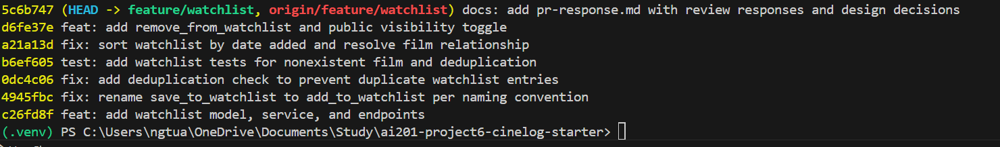

# PR Response Doc — CineLog Watchlist Feature

This document records how I addressed each of the six review comments on the
watchlist PR: the code changes I made, how I verified them, and my written
reasoning for the two design decisions (Comments 4 and 5).

## AI Usage

I used an AI assistant in four bounded ways, all verified against the actual code:

- **Orientation.** Before reading the review comments, I had the AI summarize
  `models.py`, `services/collection_service.py`, and `tests/test_collection.py`
  — what each file is responsible for and what the functions return. I confirmed
  every summary against the source (e.g., that `add_to_collection()` checks for
  an existing `CollectionEntry` and raises `AlreadyInCollectionError` before
  inserting).
- **Pattern check for deduplication (Comment 2).** I asked the AI to walk me
  through `add_to_collection()`'s duplicate handling, then wrote my own version
  for `add_to_watchlist()`. I did not have it write the dedup code.
- **Commit-format check (Milestone 4).** I pasted my `git log --oneline` output
  and asked whether the messages followed the Conventional Commits spec and
  whether any commit bundled multiple logical changes, then verified against
  https://www.conventionalcommits.org/ myself.
- **Stress-testing my design arguments (Comments 4 and 5).** After drafting my
  own positions, I asked the AI what counterargument a careful reviewer would
  raise. For Comment 4 it pushed on privacy-by-default; I had already planned to
  acknowledge that tradeoff, and it led me to tie the decision to the `public`
  visibility toggle (stretch) as the mitigation. For Comment 5 it noted
  alphabetical is better for lookup in long lists; I added that
  counter-consideration and my response to it. The reasoning below is my own,
  grounded in CineLog's code (the aggregated `average_rating`, the existing
  `get_collection()` sort order); the AI only tested it.

## Comment 1 — Rename `save_to_watchlist()` → `add_to_watchlist()`

**What I did:**
Renamed `save_to_watchlist()` to `add_to_watchlist()` in
`services/watchlist_service.py` to match the project's `verb_to_noun` naming
convention (`add_to_collection()`). Updated the one call site in
`routes/watchlist/watchlist.py` (both the `import` and the call inside
`add_film()`).

**How I verified:**
I ran a project-wide search for `save_to_watchlist` and confirmed zero
remaining references after the change. `pytest tests/ -v` passes; the app
imports and the `POST /watchlist/<user_id>/add` endpoint still returns 201.

## Comment 2 — Deduplication

**What I did:**
Added a deduplication check to `add_to_watchlist()` that mirrors
`add_to_collection()`: after confirming the film exists, it queries for an
existing `WatchlistEntry` with the same `user_id` and `film_id` and raises a
new `AlreadyInWatchlistError` if one is found, instead of inserting a duplicate.
I also added a matching `UniqueConstraint("user_id", "film_id")` to the
`WatchlistEntry` model (mirroring `CollectionEntry`) as a database-level
backstop, and taught the route to translate `AlreadyInWatchlistError` into a
`409 Conflict` — exactly how `routes/collection.py` handles
`AlreadyInCollectionError`.

**How I verified:**
Added `test_add_to_watchlist_duplicate_raises` (mirrors
`test_add_to_collection_duplicate_raises`): it adds the same film twice, asserts
`AlreadyInWatchlistError` is raised, and asserts exactly one row exists. I also
hit the endpoint manually — a second `POST` of the same `film_id` returns
`409`. `pytest tests/ -v` passes.

## Comment 3 — Missing test

**What I did:**
Created `tests/test_watchlist.py` following the fixture structure in
`tests/test_collection.py` (`app`, `sample_user`, `sample_film` fixtures with an
in-memory SQLite database). Wrote `test_add_to_watchlist_nonexistent_film_raises`
as the direct equivalent of `test_add_to_collection_nonexistent_film_raises`: it
calls `add_to_watchlist()` with a film id that isn't in the database and asserts
`FilmNotFoundError` is raised.

**How I verified:**
`pytest tests/test_watchlist.py -v` passes, and the full suite
`pytest tests/ -v` passes (10 tests). I used
`test_add_to_collection_nonexistent_film_raises` as my model, including the
"nonexistent id → domain error, not a DB integrity error" intent.

## Comment 4 — Default visibility (design decision)

**My position:**
Keep `public=True` as the default for a new watchlist entry.

**Reasoning:**
CineLog is a social, community platform, not a private notebook. The clearest
evidence is in the data model itself: `Film.average_rating` aggregates ratings
across all users, so the product's core value already depends on user activity
being shared. Defaulting watchlists to private would be inconsistent with a
product built around communal signal. A watchlist is also a discovery surface —
in a Letterboxd-style app (which CineLog closely resembles) a large part of the
value is seeing what other people intend to watch, which feeds recommendations
and social following. Because most users never change a default, a
private-by-default watchlist would, in practice, keep almost all watchlists
hidden and starve exactly the discovery features the platform exists to power.
I'm optimizing for the common case: the engaged user who wants their taste
discoverable and wants to discover others'. As a user of apps like Letterboxd
myself, my watchlist being visible is part of the point — friends see what I'm
planning to watch and we compare notes. I'd expect CineLog users to want the
same, so forcing them to opt in to that would hide exactly what makes the
feature worthwhile.

**Tradeoff acknowledged:**
Privacy-by-default is the more conservative, "principle of least surprise"
posture, and a public default risks a user unintentionally exposing intent (a
watchlist can reveal personal interests). I accept that tradeoff but mitigate it
rather than ignore it: I added an explicit `public` parameter to the
`add_to_watchlist()` endpoint (see stretch work below) so a caller can opt a
specific entry to private at creation time without relying on the default, and
I'd recommend a follow-up per-user default-visibility setting plus clear UI
labeling. The default optimizes for the social common case while keeping opt-out
cheap and explicit.

## Comment 5 — Sort order (design decision)

**My position:**
I implemented the maintainer's preference: `get_watchlist()` now returns entries
sorted by `date_added` descending (newest first) instead of alphabetically by
title.

**Reasoning:**
A watchlist is a queue of *intent*, not a static catalog. The most recently
added film is the freshest signal of what a user currently wants to watch, so
recency is the most useful default ordering. Alphabetical order treats the
watchlist like a reference index, which mismatches how the feature is actually
used.

**Engagement with reviewer's point:**
The maintainer's stated reason — "most users want to see what they added
recently" — is exactly right for a watchlist, and I agree with it. I'd add a
CineLog-specific reason that reinforces the choice: `get_collection()` already
sorts newest-first (`CollectionEntry.date_added.desc()`). Keeping the watchlist
alphabetical while the collection sorts by recency would give two nearly
identical list features two different mental models. Matching
`date_added.desc()` makes both surfaces behave consistently. What actually
settled it for me was going back and checking `get_collection()` before
deciding — it already sorts newest-first, and as a user I'd have found it
confusing for the two lists to behave differently, so matching them felt like
the obvious call.

I'll acknowledge the counter-consideration a reviewer might raise: alphabetical
ordering is genuinely better for *lookup* in a long list ("do I already have
X?"). But lookup is a search/filter concern, not a default-sort concern — the
right answer there is a search box or a client-side sort toggle, not making
every user pay an alphabetical default for the occasional lookup. The default
should serve the common "what did I just add / what's next" scan.

While making this change I also fixed a latent bug the alphabetical
implementation depended on: `WatchlistEntry` had no `film` relationship, so
`get_watchlist()`'s `entry.film.to_dict()` raised `AttributeError` and the
endpoint would have returned a 500. Sorting by `date_added` no longer needs the
`.join(Film)`, and I added the missing relationship (mirroring
`Film.collection_entries`) so `entry.film` resolves.

## Comment 6 — Rebase onto updated `main`

**What conflicted:**
While the PR was open, a refactor merged to `main` that migrated film IDs from
integer to UUID (`Film.id` and `CollectionEntry.film_id` became
`db.String(36)`). My watchlist code still modeled `WatchlistEntry.film_id` as
`db.Integer` referencing `film.id`. Rebasing `feature/watchlist` onto the
updated `main` produced a conflict in `models.py` where my `WatchlistEntry`
addition met `main`'s UUID-migrated `Film`/`CollectionEntry`.

**How I resolved it:**
I kept `main`'s UUID definitions for `Film` and `CollectionEntry`, and updated
`WatchlistEntry.film_id` to `db.Column(db.String(36), db.ForeignKey("film.id"))`
so the foreign key matches the new UUID `Film.id`. I updated the `film_id`
docstrings in `services/watchlist_service.py` from "int" to "UUID (str)". No
data or logic in `add_to_watchlist()`/`get_watchlist()` needed to change —
the code already passed `film_id` through as an opaque value, and my test's
"nonexistent film" id was already a UUID-style string.

**How I verified no conflict remains:**
`git status` showed no unmerged paths after `git add`/`git rebase --continue`.
`git log --oneline --graph` shows a linear history with **no merge commits**.
`pytest tests/ -v` passes against the UUID models, and I manually exercised
`POST /watchlist/<user_id>/add` and `GET /watchlist/<user_id>` with UUID film
ids returned by `POST /films`.

## Stretch work

- **`remove_from_watchlist(user_id, film_id)`** — added following the
  `remove_from_collection()` pattern: it looks up the entry, raises a new
  `NotInWatchlistError` (→ `404` at the route) if absent, otherwise deletes it
  and returns `True`. Covered by `test_remove_from_watchlist_removes_entry` and
  `test_remove_from_watchlist_missing_raises`, plus a
  `DELETE /watchlist/<user_id>/remove` endpoint mirroring the collection route.
- **Second (unrequested) test — `test_get_watchlist_returns_newest_first`.** I
  chose the sort-order edge case because it's the behavior Comment 5 changed and
  it's the one most likely to regress silently: a future refactor could reorder
  the query without any error surfacing. The test inserts two entries with
  explicit `date_added` timestamps out of alphabetical order (Blade Runner added
  after Alien) and asserts the recently-added one comes first — which also
  guards against an accidental revert to alphabetical sorting.
- **Visibility toggle.** Added an optional `public` parameter to
  `add_to_watchlist(user_id, film_id, public=True)` and threaded it through the
  `POST /watchlist/<user_id>/add` endpoint (`data.get("public", True)`), so
  callers can set visibility explicitly instead of relying on the default. This
  is the concrete mitigation referenced in Comment 4.

## `git log --oneline` screenshot

Seven Conventional-Commits, no merge commits, rebased linearly onto `main`
(top commit `bbe206c` below is the current `main` tip, shown for context):

```
HEAD    docs: add pr-response.md with review responses and design decisions
d6fe37e feat: add remove_from_watchlist and public visibility toggle
a21a13d fix: sort watchlist by date added and resolve film relationship
b6ef605 test: add watchlist tests for nonexistent film and deduplication
0dc4c06 fix: add deduplication check to prevent duplicate watchlist entries
4945fbc fix: rename save_to_watchlist to add_to_watchlist per naming convention
c26fd8f feat: add watchlist model, service, and endpoints
bbe206c Merge pull request #2 from ascherj/chore/add-gitignore   (main)
```

<!-- If the assignment requires an image, replace the code block above with a
     screenshot, e.g.  -->>

## PR Description

**What the feature does**
Adds a watchlist so a CineLog user can save films they want to watch (distinct
from their collection of films already watched). It introduces a
`WatchlistEntry` model, a `watchlist_service` with `add_to_watchlist()`,
`remove_from_watchlist()`, and `get_watchlist()`, and REST endpoints:

- `GET  /watchlist/<user_id>` — list the user's watchlist, newest-first
- `POST /watchlist/<user_id>/add` — body `{ "film_id": "<uuid>", "public": <bool, optional> }`
- `DELETE /watchlist/<user_id>/remove` — body `{ "film_id": "<uuid>" }`

Adding a film that isn't in the database returns `404`; adding a film already on
the watchlist returns `409` (no duplicate is created).

**Design decisions made**
1. **Default visibility:** new watchlist entries default to `public=True`,
   optimizing for CineLog's social/discovery model, with an explicit `public`
   parameter available to opt out. (See Comment 4.)
2. **Default sort order:** `get_watchlist()` returns entries by `date_added`
   descending (newest first), consistent with `get_collection()`. (See
   Comment 5.)

**How to test the feature manually**
```bash
# 1. Set up and run the app
python -m venv .venv && source .venv/bin/activate
pip install -r requirements.txt
python app.py                      # serves at http://127.0.0.1:5000

# 2. In another terminal, create a user and a film, capturing their UUIDs.
#    (Use whatever user/film creation endpoints the app exposes; example below
#     assumes POST /films returns the created film with its "id".)
FILM_ID=$(curl -s -X POST http://127.0.0.1:5000/films \
  -H 'Content-Type: application/json' \
  -d '{"title":"Dune","year":2021}' | python -c "import sys,json;print(json.load(sys.stdin)['id'])")
USER_ID=<paste a user UUID>

# 3. Add the film to the watchlist
curl -X POST http://127.0.0.1:5000/watchlist/$USER_ID/add \
  -H 'Content-Type: application/json' -d "{\"film_id\":\"$FILM_ID\"}"
# → 201 with the new entry (public: true)

# 4. Add it again → 409 Conflict (deduplication)
curl -i -X POST http://127.0.0.1:5000/watchlist/$USER_ID/add \
  -H 'Content-Type: application/json' -d "{\"film_id\":\"$FILM_ID\"}"

# 5. Add a private entry with the visibility toggle
curl -X POST http://127.0.0.1:5000/watchlist/$USER_ID/add \
  -H 'Content-Type: application/json' -d "{\"film_id\":\"$FILM_ID\",\"public\":false}"

# 6. View the watchlist (newest-first)
curl http://127.0.0.1:5000/watchlist/$USER_ID

# 7. Remove the film
curl -X DELETE http://127.0.0.1:5000/watchlist/$USER_ID/remove \
  -H 'Content-Type: application/json' -d "{\"film_id\":\"$FILM_ID\"}"
# → 200; removing again → 404

# 8. Run the automated tests
pytest tests/ -v
```
